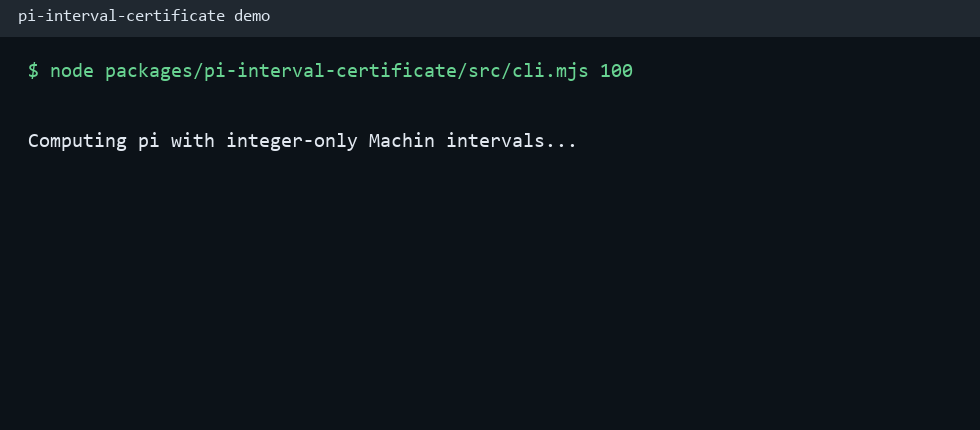

# Pi Interval Certificate

Certified finite prefixes for issue #17.

This package uses Machin's formula with integer-only arithmetic:

```text
pi = 16 * atan(1 / 5) - 4 * atan(1 / 239)
```

`certifyPiPrefix(digits)` returns:

- the requested finite decimal prefix
- scaled lower and upper bounds
- guard digit count
- term counts for each arctangent series
- a `stable` flag showing the interval agrees on the requested prefix

The module does not claim that pi has a final digit. It produces exact finite
prefixes with interval evidence that the requested prefix is stable.

## Demo



```sh
npm test -w packages/pi-interval-certificate
node packages/pi-interval-certificate/src/cli.mjs 100
```
